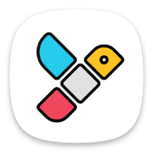
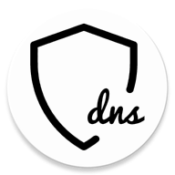

<!-- =========================================================================
src/index.md

Copyright © 2025 Network Pro Strategies (Network Pro™)
SPDX-License-Identifier: CC-BY-4.0 OR GPL-3.0-or-later
This file is part of Network Pro.
========================================================================== -->

[SPDX-License-Identifier](https://spdx.dev/learn/handling-license-info/): `CC-BY-4.0 OR GPL-3.0-or-later`

# Privacy & Security Apps and Services

**Network Pro Strategies** (Network Pro&trade;) 
**Last Updated:** November 7, 2025

A listing of the best apps and services—open source, where possible—for protecting your security and privacy online. Simply select the relevant section to see the recommended apps.

<!-- markdownlint-disable MD001 -->

### Table of Contents

??? info "Apps"

    ### Apps

    - [App Stores & Client Apps](#appstores)
    - [2FA Authenticators](#2fa)
    - [Browsers](#browsers)
    - [Email Clients](#emailclient)
    - [File Encryption Apps](#fileencryption)
    - [File Managers](#file-managers)
    - [Gallery Apps](#gallery)
    - [Health and Wellness Apps](#health-wellness)
    - [Instant Messaging Apps](#instant-messaging)
    - [Default Messaging Apps](#default-messaging)
    - [Keyboards](#keyboards)
    - [Music Apps](#music)
    - [Navigation Apps (Maps)](#navigation)
    - [Network Security & Privacy Tools](#network-tools)
    - [Notes Apps](#notes)
    - [Password Managers](#password-managers)
    - [PDF Readers](#pdf)
    - [Video Players](#video)
    - [Weather Apps](#weather)
    - [Work Profile Apps](#work-profile)
    - [YouTube Client Apps](#youtube)

??? info "Services"

    ### Services

    - [Cloud Storage Services](#cloud)
    - [Email Providers](#email-providers)
    - [Private DNS](#dns)
    - [Search Engines](#search-engines)
    - [VPN Providers](#vpn)

&nbsp;

### Legend

| Emoji | Meaning                    |
| :---- | :------------------------- |
| 👑    | Privacy Community Favorite |
| ❤️    | Top Recommendation         |
| ⭐    | Highly Recommended         |
| ❤    | Personal Favorite          |
| 💲    | Paid App or Service        |
| 🌎    | Community-maintained       |

<!-- markdownlint-enable MD001 -->

---

??? info "App Stores"

    ##  App Stores

     [Aurora Store](https://auroraoss.com/) [F-Droid](https://f-droid.org/en/packages/com.aurora.store/) | [GitLab](https://gitlab.com/AuroraOSS/AuroraStore) 🇮🇳 👑 ⭐ ❤

     [F-Droid](https://f-droid.org/) [GitLab](https://gitlab.com/fdroid/fdroidclient) 🌍 👑 ⭐

     [Obtainium](https://obtainium.imranr.dev/) [F-Droid](https://f-droid.org/en/packages/dev.imranr.obtainium.fdroid/) | [GitHub](https://github.com/ImranR98/Obtainium) 🌍 👑 ⭐ ❤

    &nbsp;

    [Back to top](#top)

??? info "Client Apps"

    ### Client Apps

     [Droid-ify](https://droidify.eu.org/) [F-Droid](https://f-droid.org/en/packages/com.looker.droidify/) | [GitHub](https://github.com/Droid-ify/client) 🌍 👑 ⭐ ❤

    &nbsp;

    [Back to top](#top)

---

??? info "2FA Authenticators"

    ## 🔐 2FA Authenticators

    _Online:_

     [Ente Auth](https://ente.io/auth/) [F-Droid](https://f-droid.org/en/packages/io.ente.auth/) 🇮🇳 👑 ⭐ ❤️ ❤

    - While Ente is an Indian company, its infrastructure is hosted in Germany and complies with the EU GDPR.

    _Offline:_

     [Aegis Authenticator](https://getaegis.app/) [F-Droid](https://f-droid.org/en/packages/com.beemdevelopment.aegis/) 🌎 👑 ⭐

    &nbsp;

    [Back to top](#top)

!!! warning "Backup / Recovery"

    Be sure to have a plan in case you lose access to your 2FA codes! 
    You should have backup/recovery codes stored securely for use in such an event.

---

## Browsers

??? info "Firefox"

    ### Firefox

     [Firefox](https://www.firefox.com/) 🇺🇸 👑 ⭐ ❤️ and its FOSS version: [Fennec](https://www.f-droid.org/packages/org.mozilla.fennec_fdroid/) [F-Droid](https://f-droid.org/en/packages/org.mozilla.fennec_fdroid/) | [Repo](https://hg.mozilla.org/mozilla-central/file/tip/mobile/android)
    🌎 👑 ⭐ ❤

    - We highly recommend using [FFUpdater](https://f-droid.org/en/packages/de.marmaro.krt.ffupdater/) [F-Droid](https://f-droid.org/en/packages/de.marmaro.krt.ffupdater/) | [GitHub](https://github.com/Tobi823/ffupdater) to install and manage privacy-centric browsers on mobile.

!!! warning "Reality Check"

    There's a misconception that in order for Firefox to be useable, it requires lots of changes and addons. Nothing could be further from the truth. In fact, there are only [a handful of truly useful addons](https://github.com/arkenfox/user.js/wiki/4.1-Extensions) (uBlock Origin, CanvasBlocker, etc.).

    Realistically, Firefox is no more complicated to set up and configure than Brave, for example. However, if you feel you need a guide, you may want to take a look here:

    - [Yet Another Firefox Hardening Guide (Archive.org)](https://web.archive.org/web/20221013104259/https://chrisx.xyz/blog/yet-another-firefox-hardening-guide/)

??? info "Firefox user.js Mods"

    ### Firefox user.js Mods

    Firefox `user.js` mods typically consist of a `user.js` file, a `prefs.js` file, or both. The `user.js` file is a user-defined configuration script that enforces specific settings each time the browser starts, allowing users to create a highly customized, secure, and private browsing environment without manually navigating Firefox’s settings or `about:config`.

    [Betterfox](https://github.com/yokoffing/Betterfox) 🌎 ⭐ ❤️ ❤

    - Removes much of the uncertainty and ambiguity involved with crafting a custom `user.js` file.
    - This project consists of the best parts of [arkenfox](https://github.com/arkenfox/user.js/wiki) and similar projects without the complexity.

    [Firefox Profilemaker](https://ffprofile.com/)

    - A very simple, straightforward tool for creating a custom `prefs.js` file (similar in function to `user.js`).
    - If you don't mind spending a little more time setting things up, [Betterfox](https://github.com/yokoffing/Betterfox) is a significant upgrade and allows for more customization.

    [arkenfox](https://github.com/arkenfox/user.js/wiki)

    - The original `user.js` modification project. While highly functional, this is only recommended for extremely advanced users.
    - For a visual overview, an [arkenfox GUI](https://arkenfox.github.io/gui/) is also available.

??? info "Firefox Forks"

    ### Firefox Forks (coming soon!)

    - Zen Browser
    - LibreWolf

---

??? info "Chromium"

    ### Chromium

     [Brave](https://play.google.com/store/apps/details?id=com.brave.browser) [GitHub](https://github.com/brave/brave-browser) 🇺🇸 👑 ⭐ [_(How to Harden Brave Browser)_](https://brave.netwk.pro)

    - Harden Brave Browser before using it! See [caveat](#chrome).
    - Can be installed using [FFUpdater](https://f-droid.org/en/packages/de.marmaro.krt.ffupdater/) [F-Droid](https://f-droid.org/en/packages/de.marmaro.krt.ffupdater/) | [GitHub](https://github.com/Tobi823/ffupdater) on mobile.

     [Cromite](https://github.com/uazo/cromite/) 🌎

    - If you want a Chrome interface, you may like Cromite. Similarly to Brave, it offers fairly robust privacy features, including Adblock. See [caveat](#chrome).
    - Can be installed on mobile with [FFUpdater](https://f-droid.org/en/packages/de.marmaro.krt.ffupdater/) [F-Droid](https://f-droid.org/en/packages/de.marmaro.krt.ffupdater/) | [GitHub](https://github.com/Tobi823/ffupdater).

    &nbsp;

    [Back to top](#top)

!!! warning "Chromium Notice"

    🚫 **_If possible, avoid using Chrome at all costs. Let your family and friends know that there are better alternatives. We recommend you let them try Cromite, as it looks very similar._**

    > Bear in mind that by utilizing Chromium-based browsers, such as Cromite and Brave, you're choosing to perpetuate Google's domination of the browser market, as well as aiding in the further proliferation of the Chromium framework.
    >
    > Cromite and Brave will significantly improve your security and better safeguard your privacy, but these browsers are, sadly, fruit of the poisonous tree. As such, you are <strong><em>strongly</em></strong> urged to utilize [Firefox](https://www.firefox.com/) or its FOSS fork, [Fennec](https://www.f-droid.org/packages/org.mozilla.fennec_fdroid/).

---

??? info "Email Clients"

    ## 📫 Email Clients

     [FairEmail](https://email.faircode.eu/) [F-Droid](https://f-droid.org/en/packages/eu.faircode.email/) 🇳🇱 👑 ⭐ ❤️ ❤

    - An incredibly privacy-conscious app with lots of options and functionality.
    - Once you get past the learning curve, it's probably one of the best email clients period.

     [Thunderbird Mobile](https://www.thunderbird.net/en-US/mobile/) [F-Droid](https://f-droid.org/en/packages/net.thunderbird.android/) 🇺🇸 ⭐

    - Newer on the scene, but feature set is similar to K-9 Mail.

     [K-9 Mail](https://k9mail.app/) [F-Droid](https://f-droid.org/en/packages/com.fsck.k9/) 🇺🇸 👑 ⭐

    - K-9 Mail has long been one of the leading email clients on Android. It's mature, privacy-focused, and open source.

    > Thunderbird Mobile and K-9 Mail share the same code base and are, therefore, very similar. It's expected that K-9 Mail will ultimately wind down at some point, as the K-9 Mail project joined the Thunderbird family in 2022.

    &nbsp;

    [Back to top](#top)

---

??? info "File Encryption Apps"

    ## 📁 File Encryption Apps

     [Cryptomator](https://cryptomator.org/) [F-Droid](https://f-droid.org/en/packages/org.cryptomator.lite/) | [Play Store](https://play.google.com/store/apps/details?id=org.cryptomator) 🇩🇪 👑 ⭐ ❤

    - Note that the F-Droid version of Cryptomator **cannot** interface with Google Drive, as it is stripped of third-party libraries.
    - If you want Google Drive integration, use the Play Store version.

     [OpenKeychain](https://www.openkeychain.org/) [F-Droid](https://f-droid.org/en/packages/org.sufficientlysecure.keychain/) 🇩🇪 👑 ⭐ ❤

    - OpenKeychain requires a compatible app, such as FairEmail, K-9 Mail, etc.

    &nbsp;

    [Back to top](#top)

---

??? info "File Managers"

    ## 📂 File Managers

     [Material Files](https://www.f-droid.org/packages/me.zhanghai.android.files/) [GitHub](https://github.com/zhanghai/MaterialFiles) 🇺🇸 👑 ⭐

     [Amaze File Manager](https://teamamaze.xyz/) [F-Droid](https://www.f-droid.org/packages/com.amaze.filemanager/) | [GitHub](https://github.com/TeamAmaze/AmazeFileManager) 🇮🇳

     [Cx File Explorer](https://play.google.com/store/apps/details?id=com.cxinventor.file.explorer) ❤

    - Proprietary, contains trackers. Included for functionality reasons.

    &nbsp;

    [Back to top](#top)

!!! warning "Notice"

    ❌ Avoid **Files by Google** if possible.

---

??? info "Gallery Apps"

    ## 🖼️ Gallery Apps

     [Aves Libre](https://f-droid.org/en/packages/deckers.thibault.aves.libre/) [GitHub](https://github.com/deckerst/aves) 🇨🇵 👑 ⭐ ❤️ ❤

     [Fossify Gallery](https://www.fossify.org/apps/) [F-Droid](https://f-droid.org/packages/org.fossify.gallery/) | [GitHub](https://github.com/FossifyOrg/Gallery) 🌍 👑 ⭐

    &nbsp;

    [Back to top](#top)

---

??? info "Health and Wellness Apps"

    ##  Health and Wellness Apps

     [Loop Habit Tracker](https://f-droid.org/en/packages/org.isoron.uhabits/) [GitHub](https://github.com/iSoron/uhabits) 🇺🇸

    &nbsp;

    [Back to top](#top)

---

??? info "Instant Messaging Apps"

    ## 💬 Instant Messaging Apps

     [Molly](https://github.com/mollyim/mollyim-android) 🌎 ⭐ ❤

    - A hardened Signal fork for Android with enhanced security features, including stronger sandboxing, PIN protection, reproducible builds, and optional Tor support.
    - Molly maintains full compatibility with Signal’s servers and protocol, offering a drop-in replacement with better local device security.

     [Signal](https://signal.org/) [Play Store](https://play.google.com/store/apps/details?id=org.thoughtcrime.securesms) 🇺🇸 👑 ⭐ ❤️

    - The gold standard for end-to-end encrypted messaging, with strong forward secrecy and minimal metadata exposure.
    - Centralized infrastructure; self-hosting not supported.

     [Element](https://element.io/) ([Matrix](https://matrix.org/) Client) [F-Droid](https://f-droid.org/en/packages/im.vector.app/) 🇬🇧 ⭐

    - Federated and self-hostable secure messaging platform built on the Matrix protocol.
    - Encryption is optional and slightly weaker than Signal, but still robust for most use cases.

     [Session](https://getsession.org/) [Play Store](https://play.google.com/store/apps/details?id=network.loki.messenger) 🇦🇺

    - Anonymous, Signal-based messenger using a decentralized relay network.
    - Strong metadata resistance, but slower sync and limited federation.

     [SimpleX](https://simplex.chat/) [F-Droid](https://f-droid.org/en/packages/chat.simplex.app/) 🇬🇧

    - Fully anonymous messenger with no user IDs or contact lists.
    - Extreme metadata privacy; ideal for sensitive use cases but still early in development.

    &nbsp;

    [Back to top](#top)

---

??? info "Default Messaging Apps (Offline)"

    ##  Default Messaging Apps

    **_Section pending update._**

     [Fossify Messages](https://f-droid.org/en/packages/org.fossify.messages/) [GitHub](https://github.com/FossifyOrg/Messages) 🌎 👑 ⭐

    - Free and open source messaging app.

     [Textra](https://textra.me/) [Play Store](https://play.google.com/store/apps/details?id=com.textra) ❤ 💲

    - A highly functional, paid messaging app. Not strictly privacy/security-related.
    - Proprietary, has several trackers, but worth mentioning for pure functionality.

    &nbsp;

    [Back to top](#top)

---

??? info "Keyboard Apps"

    ## ⌨️ Keyboards

     [HeliBoard](https://f-droid.org/en/packages/helium314.keyboard/) [GitHub](https://github.com/Helium314/HeliBoard) 🌍 👑 ⭐ ❤️ ❤

     [Florisboard](https://f-droid.org/en/packages/dev.patrickgold.florisboard/) [GitHub](https://github.com/florisboard/florisboard) 🌍

    &nbsp;

    [Back to top](#top)

---

??? info "Music Apps"

    ## 🎵 Music Apps

    **_Section pending update._**

     [VLC](https://www.videolan.org/vlc/) [F-Droid](https://f-droid.org/en/packages/org.videolan.vlc/) | [Repo](https://code.videolan.org/videolan/vlc-android) 🇫🇷 👑 ⭐

     [Pulsar Music Player](https://rhmsoft.com/pulsar/) [Play Store](https://play.google.com/store/apps/details?id=com.rhmsoft.pulsar) ❤ 💲

    &nbsp;

    [Back to top](#top)

---

??? info "Navigation Apps"

    ##  Navigation Apps (Maps)

     [OsmAnd](https://osmand.net/) [F-Droid](https://f-droid.org/en/packages/net.osmand.plus/) | [GitHub](https://github.com/osmandapp/) 🇳🇱 👑 ⭐

     [Organic Maps](https://organicmaps.app/) [F-Droid](https://f-droid.org/en/packages/app.organicmaps/) | [GitHub](https://github.com/organicmaps/organicmaps) 🇪🇪

    &nbsp;

    [Back to top](#top)

---

??? info "Network Security & Privacy Tools"

    ## 🧱 Network Security & Privacy Tools

     [RethinkDNS + Firewall](https://rethinkdns.com/app) [F-Droid](https://f-droid.org/en/packages/com.celzero.bravedns/) | [GitHub](https://github.com/celzero/rethink-app) 🌍 👑 ⭐ ❤️ ❤

     [NetGuard](https://netguard.me/) [F-Droid](https://f-droid.org/en/packages/eu.faircode.netguard/) | [GitHub](https://github.com/M66B/NetGuard) 🇳🇱 👑

     [InviZible](https://invizible.net/en/) [F-Droid](https://f-droid.org/en/packages/pan.alexander.tordnscrypt.stable/) | [GitHub](https://github.com/Gedsh/InviZible) 🌍 👑

    - Privacy stack (Tor, I2P, DNSCrypt).
    - Typically used alongside a firewall, such as NetGuard.

     [sing-box](https://sing-box.sagernet.org/) [F-Droid](https://f-droid.org/en/packages/io.nekohasekai.sfa/) | [GitHub](https://github.com/SagerNet/sing-box) 🌍 ❤

    - Advanced proxy core / tunneling engine.
    - Used by RethinkDNS and others to enable censorship circumvention, encryption, and protocol obfuscation.

    &nbsp;

    [Back to top](#top)

---

??? info "Notes Apps"

    ## 📝 Notes Apps

     [Notesnook](https://notesnook.com/) [F-Droid](https://f-droid.org/en/packages/com.streetwriters.notesnook/) | [GitHub](https://github.com/streetwriters/notesnook) 🇵🇰 👑 ⭐ ❤️ ❤

    - Private, end-to-end encrypted note-taking app with a focus on zero-knowledge sync.
    - Open source and cross-platform, with no account required for local use.

     [Standard Notes](https://standardnotes.com/) [F-Droid](https://f-droid.org/en/packages/com.standardnotes/) | [GitHub](https://github.com/standardnotes/app) 🇺🇸 ⭐

    - Encrypted, cross-platform note-taking app based in the United States.
    - Offers end-to-end encryption for all data, with optional advanced features like encrypted file attachments and publishing.

     [Obsidian](https://obsidian.md/) [Play Store](https://play.google.com/store/apps/details?id=md.obsidian) | [GitHub](https://github.com/obsidianmd) 🇨🇦 ⭐ ❤

    - Powerful Markdown-based note system focused on local-first storage and offline access.
    - Not open source, but no account required and all data stays on-device by default.

    &nbsp;

    [Back to top](#top)

---

??? info "Password Managers"

    ## 🔑 Password Managers

    _Online:_

     [Proton Pass](https://proton.me/pass) [F-Droid](https://f-droid.org/en/packages/proton.android.pass.fdroid/) 🇨🇭 👑 ⭐ ❤️ ❤

     [Bitwarden](https://bitwarden.com/) [Play Store](https://play.google.com/store/apps/details?id=com.x8bit.bitwarden) 🇺🇸 ⭐

    _Offline:_

     [KeePassDX](https://www.keepassdx.com/) [F-Droid](https://f-droid.org/en/packages/com.kunzisoft.keepass.libre/) 🇫🇷 👑 ⭐

    &nbsp;

    [Back to top](#top)

---

??? info "PDF Readers"

    ## 📖 PDF Readers

     [Simple PDF Viewer](https://github.com/GrapheneOS/PdfViewer) 🌍 👑 ⭐ ❤️ ❤

     [Librera Reader](https://librera.mobi/) [F-Droid](https://f-droid.org/en/packages/com.foobnix.pro.pdf.reader/) | [GitHub](https://github.com/foobnix/LibreraReader) 🇺🇦 👑 ⭐

    &nbsp;

    [Back to top](#top)

---

??? info "Video Players"

    ## 🎞️ Video Players

    **_Section pending update._**

     [VLC](https://www.videolan.org/vlc/) [F-Droid](https://f-droid.org/en/packages/org.videolan.vlc/) | [Repo](https://code.videolan.org/videolan/vlc-android) 🇫🇷 👑 ⭐

     [MPV](https://f-droid.org/en/packages/is.xyz.mpv/) [GitHub](https://github.com/mpv-android/mpv-android) 🌍

    &nbsp;

    [Back to top](#top)

---

??? info "Weather Apps"

    ## ☔ Weather Apps

     [Weather Master](https://apt.izzysoft.de/fdroid/index/apk/com.pranshulgg.weather_master_app) [GitHub](https://github.com/PranshulGG/WeatherMaster) ⭐ ❤️ ❤

     [OSS Weather](https://apt.izzysoft.de/fdroid/index/apk/com.akylas.weather) [GitHub](https://github.com/Akylas/oss-weather) ⭐

     [QuickWeather](https://f-droid.org/packages/com.ominous.quickweather/) [GitHub](https://github.com/TylerWilliamson/QuickWeather)

    &nbsp;

    [Back to top](#top)

---

??? info "Work Profile Apps"

    ##  Work Profile Apps

     [Shelter](https://www.f-droid.org/packages/net.typeblog.shelter/) [Gitea](https://gitea.angry.im/PeterCxy/Shelter) 🌍 👑 ⭐ ❤️

    - FOSS sandboxing tool using Android's Work Profile; great for isolating untrusted apps and managing dual accounts

     [Insular](https://secure-system.gitlab.io/Insular/) [F-Droid](https://f-droid.org/en/packages/com.oasisfeng.island.fdroid/) | [GitLab](https://gitlab.com/secure-system/Insular) 🌍

    - Power-user variant of Shelter with additional controls, but less consistently maintained and more opinionated in design

    > Android Work Profile is used to isolate apps that present a security or privacy risk.
    > It creates an isolated profile from which you can install and run sensitive applications.

    &nbsp;

    [Back to top](#top)

---

??? info "YouTube Client Apps"

    ##  YouTube Client Apps

     [YouTube Revanced](https://revanced.app/) [GitHub](https://github.com/revanced/revanced-manager) 🌍 👑 ⭐ ❤️ ❤

     [NewPipe](https://newpipe.net/) [F-Droid](https://f-droid.org/en/packages/org.schabi.newpipe/) | [GitHub](https://github.com/TeamNewPipe/NewPipe/) 🌍 👑 ⭐

     [LibreTube](https://libretube.dev/) [F-Droid](https://f-droid.org/en/packages/com.github.libretube/) | [GitHub](https://github.com/libre-tube/LibreTube) 🌍

    &nbsp;

    [Back to top](#top)

---

??? info "Cloud Storage Services"

    ## ☁️ Cloud Storage Services

     [Proton Drive](https://proton.me/drive) [Play Store](https://play.google.com/store/apps/details?id=me.proton.android.drive) 🇨🇭 👑 ⭐ ❤

    - End-to-end encrypted storage.
    - Proton currently grants 2 GB of free storage upon account creation. If you complete their onboarding steps, you can obtain 5 GB total of free storage.

     [Tresorit](https://tresorit.com/) [Play Store](https://play.google.com/store/apps/details?id=com.tresorit.mobile) 🇨🇭 ⭐

    - End-to-end encrypted storage.
    - [Tresorit Basic](https://tresorit.com/pricing/basic) provides 3 GB of free storage.

     [NextCloud](https://nextcloud.com/) [F-Droid](https://f-droid.org/en/packages/com.nextcloud.client/) 🇩🇪 👑 ⭐

    - Nextcloud is a self-hosted platform that can provide file storage, in addition to many other features.
    - Encryption is an optional add-on.

    &nbsp;

    [Back to top](#top)

---

??? info "Email Providers"

    ## 📧 Email Providers

     [Proton Mail](https://proton.me/mail) [Play Store](https://play.google.com/store/apps/details?id=ch.protonmail.android) 🇨🇭 👑 ⭐ ❤

     [Tuta Mail](https://tuta.com/secure-email) [F-Droid](https://f-droid.org/en/packages/de.tutao.tutanota/) 🇩🇪 👑 ⭐

    > Both Proton and Tuta offer great service and value. You really can't go wrong either way.

    &nbsp;

    [Back to top](#top)

---

??? info "Private DNS"

    ## 🌐 Private DNS

    _Customizable:_

     [Control D](https://controld.com) 🇨🇦 👑 ⭐ ❤️ ❤

     [NextDNS](https://nextdns.io/) 🇺🇸

    > Both Control D and NextDNS offer comparable services, though Control D offers the unique ability to "redirect" services via transparent proxies. While Control D receives regular updates, the same cannot be said of NextDNS.

    _Not Customizable:_

     [Quad9](https://quad9.net/) 🇨🇭 ⭐

     [AdGuard DNS](https://adguard-dns.io/) 🇨🇾

    &nbsp;

    [Back to top](#top)

!!! warning "Notice"

    [Learn to setup Private DNS](https://www.online-tech-tips.com/computer-tips/what-is-private-dns-and-how-to-use-it/)

---

??? info "Search Engines"

    ## 🔍 Search Engines

     [SearXNG](https://docs.searxng.org/)</a> 🌎 👑 ❤️ ❤

     [Brave Search](https://search.brave.com/) 🇺🇸 ⭐ ❤

     [DuckDuckGo](https://duckduckgo.com/) 🇺🇸 ⭐

     [StartPage](https://www.startpage.com/) 🇳🇱

     [Kagi](https://kagi.com/) 🇺🇸 👑 💲

    &nbsp;

    [Back to top](#top)

---

??? info "VPN Providers"

    ## 🔒 VPN Providers

     [Mullvad VPN](https://mullvad.net/en/) [F-Droid](https://f-droid.org/en/packages/net.mullvad.mullvadvpn/) 🇸🇪 👑 ⭐ ❤️ ❤

     [Proton VPN](https://protonvpn.com/)</a> [F-Droid](https://f-droid.org/en/packages/ch.protonvpn.android/) 🇨🇭 ⭐

     [IVPN](https://www.ivpn.net/en) [F-Droid](https://f-droid.org/en/packages/net.ivpn.client/) 🇬🇮

    &nbsp;

    [Back to top](#top)

!!! warning "Notice"

    Please be aware of how VPNs work and whether they would actually benefit you. Contrary to what is widely believed/marketed, VPNs **do not** provide anonymity. They provide a private connection to a service provider other than your ISP, which lends a measure of privacy. For anonymity, take a look at the [Tor Project](https://www.torproject.org/).

---

**Please provide feedback and suggestions by [creating an issue](https://github.com/netwk-pro/netwk-pro.github.io/issues/new/choose) or posting in [Discussions](https://github.com/netwk-pro/netwk-pro.github.io/discussions). _If you liked this list, please give it a STAR ⭐._**

> **Special thanks to the original author of this content, [@finalboss@mas.to](https://mas.to/@finalboss).**
